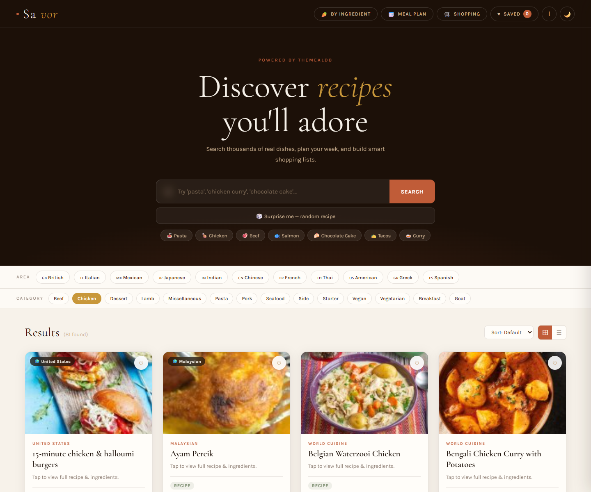

# 🍽️ Savor - Advanced Recipe Finder


A polished, responsive recipe finder built with pure HTML, CSS, and Vanilla
JavaScript. Powered by TheMealDB API, Savor helps users discover recipes, save
favorites, plan meals, and generate shopping lists without any framework or
build setup.

---

## 🌐 Live Demo

> [https://savor-recipe-finder.netlify.app/](https://savor-recipe-finder.netlify.app/)

---

## 📸 Preview

> 

---

## ✨ Features

- **🔎 Recipe Search** - Find recipes by keyword using TheMealDB API
- **🥕 Ingredient Search** - Add ingredients and discover matching meal ideas
- **🌍 Cuisine Filters** - Browse popular recipe areas like Italian, Indian, Thai, and more
- **📚 Category Browsing** - Load categories from the API and filter recipes quickly
- **🎲 Random Recipe** - Open a surprise recipe with one click
- **📖 Recipe Details** - View images, cuisine, category, ingredients, instructions, and external links
- **♥ Saved Recipes** - Save favorite recipes locally for later
- **⭐ Ratings & Notes** - Rate dishes and keep personal cooking notes
- **📅 Meal Planner** - Plan meals across the week
- **🛒 Shopping List** - Generate shopping items from planned recipes
- **👨‍🍳 Cooking Mode** - Follow recipe steps with a built-in timer
- **🌙 Dark Mode** - Persist theme preference with `localStorage`

---

## 🗂️ Project Structure

```text
savor-recipe-finder/
│
├── index.html              # App layout and markup
├── style.css               # Styles, variables, panels, modals, and responsive design
├── app.js                  # API fetching, state, rendering, and app logic
└── images/
    └── desktop-view.png    # Desktop preview screenshot
```

---

## 🚀 Getting Started

No build tools or installations required.

### 1. Clone the repository

```bash
git clone https://github.com/YOUR-USERNAME/savor-recipe-finder.git
```

### 2. Open in browser

```bash
cd savor-recipe-finder
open index.html
```

Or simply double-click `index.html` — it runs entirely in the browser.

> **Note:** Requires an internet connection to fetch recipes from
> [TheMealDB API](https://www.themealdb.com/).

---

## 🎮 How to Use

| Action             | How                                                  |
| ------------------ | ---------------------------------------------------- |
| Search recipes     | Type a recipe name and click **Search**              |
| Quick search       | Click one of the suggestion chips                    |
| Browse cuisine     | Click an area filter like Italian, Indian, or Thai   |
| Browse category    | Click a category chip loaded from the API            |
| Search ingredients | Open **By Ingredient**, add ingredients, then search  |
| View details       | Click any recipe card                                |
| Save recipe        | Click **Save** inside the recipe modal               |
| Add notes/rating   | Use the notes and rating controls in the modal       |
| Plan meals         | Open **Meal Plan** and add recipes to weekly slots   |
| Make shopping list | Generate shopping items from the meal planner        |
| Start cooking mode | Open a recipe and launch step-by-step cooking mode   |
| Close popup/panels | Press `Esc` or click outside the active panel        |

---

## 💻 Key JavaScript Concepts

- **State Management** - Centralized app state for recipes, filters, favorites, planner, and shopping list
- **Async Fetch** - TheMealDB calls for search, lookup, filters, categories, and random recipes
- **DOM Manipulation** - Dynamic recipe cards, modal content, planner slots, and shopping rows
- **localStorage** - Persistent favorites, ratings, notes, theme, meal plan, and shopping list
- **Drag & Drop** - Recipe planning workflow through draggable cards
- **IntersectionObserver** - Smooth progressive result rendering
- **Timers** - Cooking mode timer with start, pause, and reset controls
- **Error Handling** - Toast messages, empty states, and graceful API fallbacks
- **ES6+** - `const`/`let`, template literals, arrow functions, maps, sets, and spread syntax

---

## 🎨 Design Highlights

- **Editorial recipe style** - Warm food-inspired palette with elegant serif headings
- **CSS Custom Properties** - Theme tokens for colors, shadows, cards, and backgrounds
- **Sticky Header** - Fast access to ingredient search, planner, shopping list, saved recipes, info, and theme
- **Modal Workflows** - Recipe details, planner, shopping list, saved recipes, and cooking mode panels
- **Micro-interactions** - Hover lifts, active chips, animated loader, and toast feedback
- **Responsive Layout** - Search, filters, recipe cards, and panels adapt to mobile screens
- **Dark Theme** - Theme toggle with persisted preference

---

## 📦 Dependencies

All loaded via CDN or browser APIs — no `npm install` needed.

| Resource                                                     | Purpose      |
| ------------------------------------------------------------ | ------------ |
| [Google Fonts - Cormorant Garamond & Karla](https://fonts.google.com/) | Typography   |
| [TheMealDB API](https://www.themealdb.com/)                  | Recipe data  |
| Browser `localStorage`                                      | Persistence  |
| Browser `Fetch API`                                         | API requests |

---

## 🛠️ Possible Improvements

- [ ] Add live nutritional information
- [ ] Add grocery categories for shopping list items
- [ ] Add printable meal plan view
- [ ] Add offline fallback recipe samples
- [ ] Add import/export for saved recipe data
- [ ] Add advanced search filters for prep time or tags

---

## 🙌 Acknowledgements

- [TheMealDB](https://www.themealdb.com/) - free recipe API
- [Google Fonts](https://fonts.google.com/) - typography

---

> Built with ❤️ using pure HTML, CSS & JavaScript — no frameworks needed.
